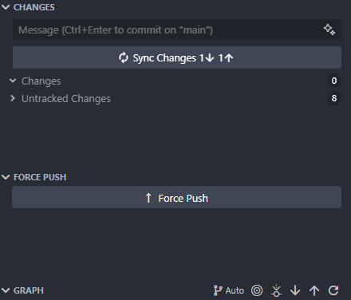

# Force Push Button

Adds a force push button to the source control view.

## Features

- Button is automatically enabled when you have incoming commits
- Button is disabled during force push operations
- Integrates with VS Code's built-in Git functionality
- Button can be freely rearranged within the source control view using drag and drop
- Configurable vertical alignment (top, center, or bottom)




## Extension Settings

The extension can be configured using the following settings:

* `git.allowForcePush`: Automatically set to `true` on first installation
* `forcePushButton.updateInterval`: Interval in milliseconds to check for Git state changes (default: 1000ms, min: 100ms, max: 10000ms)
* `forcePushButton.showNotifications`: Show notifications for force push success/failure (default: true)
* `forcePushButton.alignment`: Vertical alignment of the button in the source control view (default: "top", options: "top", "center", "bottom")

### Example settings.json

```json
{
    "forcePushButton.updateInterval": 2000,
    "forcePushButton.showNotifications": true,
    "forcePushButton.alignment": "bottom"
}
```

