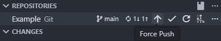

# Force Push Button

Adds a big Force Push button to the Source Control view and a per-repo Force Push button in the Source Control title bar.

## Features

- Per-repo Force Push button in the Source Control title bar
- Big Force Push button inside the Source Control view
- Respects VS Code Git settings: `git.allowForcePush`, `git.useForcePushWithLease`, `git.useForcePushIfIncludes`
- Button is disabled while a push is in progress
- The button are only enabled/visible when we have incoming commits
- Configurable vertical alignment for the button (top, center, bottom)





## Extension Settings

The extension can be configured using the following settings:

* `git.allowForcePush`: Automatically set to `true` on first installation
* `forcePushButton.updateInterval`: Interval in milliseconds to check for Git state changes (default: 1000ms, min: 100ms, max: 10000ms)
* `forcePushButton.showNotifications`: Show notifications for force push success/failure (default: true)
* `forcePushButton.alignment`: Vertical alignment of the button in the source control view (default: "top", options: "top", "center", "bottom")

### Example settings.json

```json
{
    "forcePushButton.updateInterval": 2000,
    "forcePushButton.showNotifications": true,
    "forcePushButton.alignment": "bottom",
}
```

